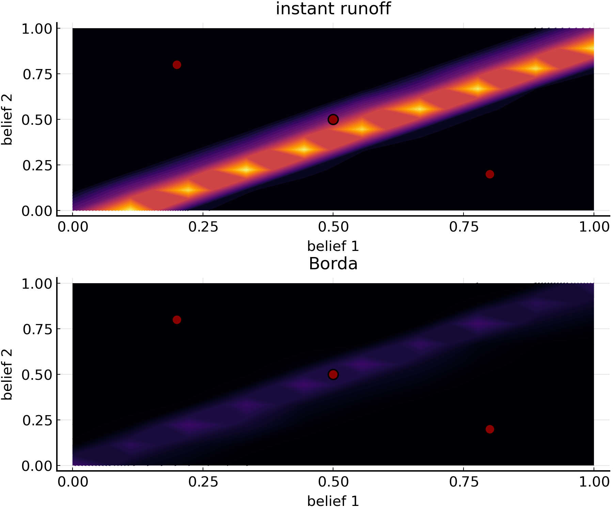

# RankChoiceVoting.jl (Work in progress)

[](https://itsdfish.github.io/RankChoiceVoting.jl/dev/)

[](https://itsdfish.github.io/RankChoiceVoting.jl/dev/) [](https://github.com/itsdfish/RankChoiceVoting.jl/actions/workflows/CI.yml)

This package provides a framework for simulating and evaluating rank choice voting systems. 

# Rank Choice Voting Systems 

Rank choice voting systems allow voters to order candidates according to preference rather than providing a single selection of the most preferred candidate. Each rank choice voting system specifies a rule for aggregating individual rankings into a societial ranking from which a winner is selected. Importantly, the rules can provide different election outcomes. 

## Limitations

Interestingly, Arrow's impossibility theorem demonstrates that it is impossible to design a rank choice voting system that can satisfy a set of fairness criteria in all possible elections. What this means is that every rank choice voting system is flawed to some degree, and may lead to undesirable behavior in some situations. Although insightful, many interesting questions remain unanswered by Arrow's impossibility theorem. For example, how prevalent are violations of fairness critera, and under what conditions are they violated? This package is designed to help answer questions of this nature.

## Example

Prior research has established that the instant runoff and the Borda voting systems can violate the Condorcet criterion which states that if a candidate wins each head-to-head competition, then the election system should select that candidate. Suppose, however, that we are interested in comparing conditions and degree to which the instant runoff and Borda count violate the Condorcet criterion. The figure below shows the chance of violating the Condorcet criterion at different points in two-dimensional belief space. Candidates are represented as red dots within the belief space and exhibit a one to one trade-off along both dimensions. The chance of a violation is color coded such that black indicates a 0% chance and yellow indicates a 65% chance. Notably, the violations tend to occur near the identity line for both systems, but the instant runoff system has a much higher chance of violating the Condorcet criterion.  



# API Overview 

As described below, the API consists of voting system objects and fairness criterion objects. Various functions allow the user to determine a winner and to determine whether a voting system violates a fairness criterion for a given set of rankings. 

## Voting Systems 

The following voting systems are currently implimented:

- Borda Count
- Bucklin 
- instant runoff

## Fairness Criteria

The following fairness criteria are currently implimented: 

- Condorcet winner
- Condorcet loser
- consistency
- majority
- mutual majority
- monotonicity
- reversal symmetry

# Functions 

The package provides the following functions:

- compute_ranks
- evaluate_winner
- satisfies
- count_violations

# API

## Voting Systems

All voting systems are a subtype of an abstract type called `VotingSystem`. Each voting system has a minimum of two fields: a vector of unique rankings called `uranks`, and the corresponding counts called `counts`. The following example is for the instant runoff voting system:

```julia
mutable struct InstantRunOff{T,I<:Integer} <: VotingSystem
    uranks::Vector{Vector{T}}
    counts::Vector{I}
end
```

## Fairness Criteria

The API also consists of objects representing a fairness criteria. Each fairness criterion is a subtype of an abstract type called `Criterion`. As an example consider, the criterion reversal symmetry, according to which a winning candidate cannot also win if each voters preferences are reversed (e.g., [1,2,3] -> [3,2,1]). In RankChoiceVoting.jl, the object for the reversal symmetry criterion is defined as follows:

```julia
mutable struct ReversalSymmetry <: Criterion

end
```

Note that fields are not required by default, but can be added to new types as needed. 

## Evaluting a Winner

The function `evaluate_winner` is used to determine the winner of an election. In the following example, a set of 1,000 votes are sampled from a uniform distribution over ranks and evaluated with an instant runoff system.

```julia
using RankChoiceVoting

rankings = map(_ -> [1,2,3], 1:1000)
shuffle!.(rankings)
system = InstantRunOff(rankings)
winner = evaluate_winner(system)
```

## Criteria Satisfaction

The function `satisfies` tests whether a voting system satisfies a criterion for a specific set of rank choice votes. In cases, where there are more than one possible violation (e.g., monotonicity), a Monte Carlo procedure is used to explore the space and true is returns as soon as a violation is found. 

### Example: a violation of reversal symmetry

The following example demonstrates how to use RankChoiceVoting.jl to test whether the instant runoff voting system violates the reveral symmetry criterion in a specific example. An instant runoff voting system iteratively eliminates the candidate with the minimum first preferences until one canidate reaches 50% first preferences. According to the reversal systemetry criterion, a winner of an election cannot win if each voter's ranks are reversed.  

Consider a hypothetical rank choice tally in the table below taken from lô (2014). 

| Counts | 4 | 3 | 2 |
|--------|---|---|---|
| First  | a | b | c |
| Second | b | c | a |
| Third  | c | a | b |

In the fist iteration, leading candidate `a` does not have a majority first preference (i.e., 4/9 < .50). In the next, round candidate c is eliminated, yielding

| Counts | 4 | 3 | 2 |
|--------|---|---|---|
| First  | a | b | a |
| Second | b | a | b |

which means candidate `a` now has a majority first preference: 6/9 > .50. 

Let's use RankChoiceVoting.jl to check whether reversal symmetry is violated in this example. 

First, load RankChoiceVoting into your session:

```julia
using RankChoiceVoting
```

Next, create the rankings in the first table above:

```julia
rankings = Vector{Vector{Symbol}}()
push!(rankings, [[:a,:b,:c] for _ ∈ 1:4]...)
push!(rankings, [[:b,:c,:a] for _ ∈ 1:3]...)
push!(rankings, [[:c,:a,:b] for _ ∈ 1:2]...)
```
Now, create an instant runoff voting system object:

```julia
system = InstantRunOff(rankings)
```

The winner of the election under an instant runoff voting system can be determined with the function 
`evaluate_winner` as follows:

```julia
evaluate_winner(system)
```
In agreement with the worked example above, the result is candidate `a`. In RankChoiceVoting.jl, the function `satisfies` determines whether a voting system complies with a given criterion for the provided rankings. This can be achieved with the following code:
```julia 
criteria = ReversalSymmetry()
violations = satisfies(system, criteria)
```
which yields true for this example.  
## Counting Violations

The function `count_violations` will count the number of violations of a fairness criterion in a set of ranked choice votes under a specified voting system. Depending on the fairness criterion, the maximum number of violations can be greater than 1. 

# References

lô Gueye, A. (2014). Failures of reversal symmetry under two common voting rules. Economics Bulletin, 34(3), 1970-1975.